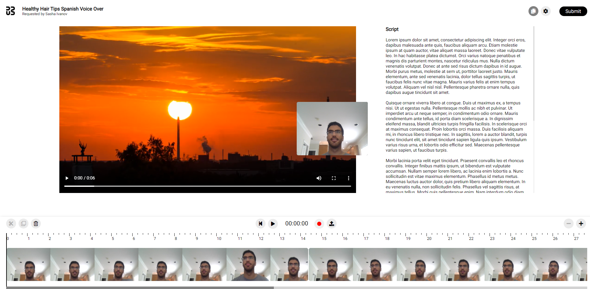
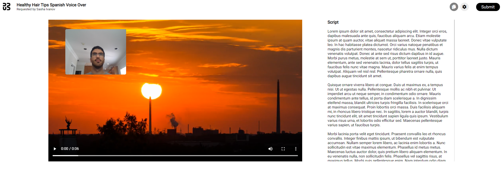
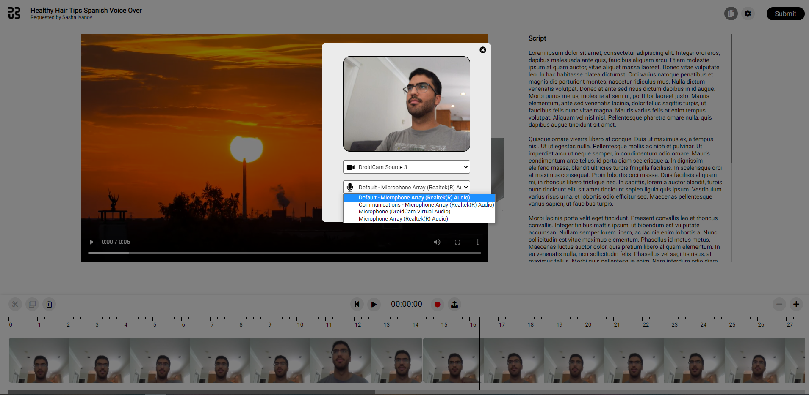
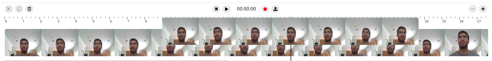
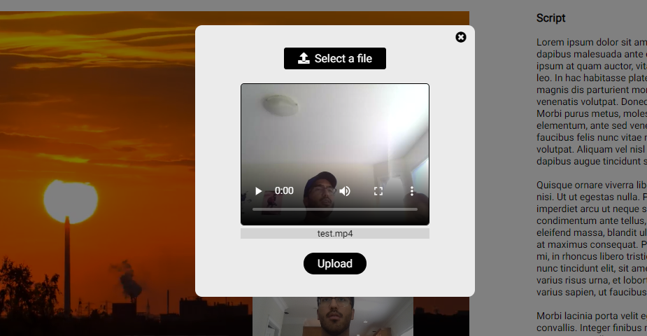

# Dubly Video Sharing Application
A file sharing and video editing tool made entirely in JavaScript providing a medium to share content between Dubly and their users. Users will receive the original video and a script, and will have the ability to record themselves dubbing the video solely in this single application. The application provides convenient editing features to optimize the recording experience and ensure the final result meets the user's satisfaction. A brief overview of features can be found below.

## Features

### Recording

A user can click on the record button to record a video clip for any desired amount of time. The time is tracked by a timer in the bottom toolbar. Upon stopping the recording, frames are extracted from the clip and shown in the bottom toolbar with the length of the clip corresponding to its duration. A user can then scroll through the timeline to view all of their clips. The timeline can also be zoomed into and out of to get a better view of the frames.

The user's video container can be freely dragged to reposition to accommodate personal preferences for viewing the script and main video.

### Playback

Clicking the play button will initiate the playback of the videos in order. A timeline scrubber tracks progression of the playback, and can be paused and/or restarted at any time. Clips can also be deleted by selecting one and clicking on the trash bin icon.

### Video seeking

A specific time in a video can be seeked by clicking and dragging the timeline scrubber to the desired position. The playback will briefly load after releasing the scrubber, upon which the videos can then be played starting at the specified time.

### Selecting video and audio input sources

Clicking on the settings icon on the top right corner displays a settings panel where the user can select different media input sources. The new sources can be previewed in the settings panel before clicking 'Save' to finalize the selection and close the panel.

### Rearranging videos

Videos can be rearranged in the timeline by clicking and dragging them to the desired position. The playback loop will be updated accordingly.

### Uploading videos

Clickling on the upload button presents an upload panel, where an existing video file can be uploaded to the application. The video can be previewed before finalizing the upload, upon which it will be displayed on the video timeline alongside the other video clips.

## Running the application

The application is built with Webpack, therefore running it in a development environment only requires running the following scripts:

1. **npm install** (installs the dependencies)
2. **npm start** (starts the Webpack DevServer for hosting the application locally)

## Project management

A kanban board on Github was used to track the progress and outline any remaining tasks.

https://github.com/arsalanfardi/dubly-app/projects/1